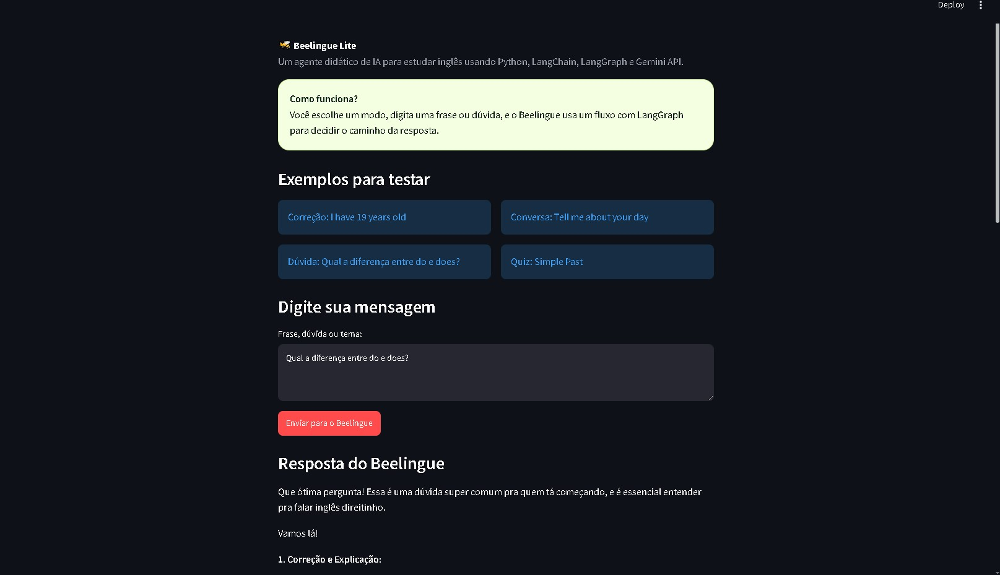

# 🐝 Beelingue Lite Didático

Projeto simples em **Python** para estudar **LangChain**, **LangGraph** e **Gemini API** criando um professor de inglês com IA.

---




## O que o projeto faz?

O Beelingue Lite permite que o usuário escolha um modo de estudo:

- Corrigir frase em inglês
- Conversar em inglês
- Gerar quiz
- Explicar dúvida

Depois, a mensagem passa por um fluxo criado com **LangGraph**:

```txt
START
  ↓
load_memory
  ↓
understand_request
  ↓
rota condicional
  ├── correct_phrase
  ├── conversation_teacher
  ├── create_quiz
  └── explain_doubt
  ↓
save_interaction
  ↓
END
```

A resposta é gerada por IA real usando a **Gemini API** através do **LangChain**.

---

## Tecnologias usadas

- Python
- Streamlit
- LangChain
- LangGraph
- Gemini API
- langchain-google-genai
- python-dotenv
- JSON para memória simples

---


## Como criar a chave da Gemini API

1. Acesse:

```txt
https://aistudio.google.com/app/apikey
```

2. Crie uma chave de API.

3. Copie a chave.

4. Na raiz do projeto, copie o arquivo `.env.example` e renomeie para `.env`.

No Windows PowerShell:

```bash
copy .env.example .env
```

No Linux/Mac:

```bash
cp .env.example .env
```

5. Abra o `.env` e coloque sua chave:

```env
GOOGLE_API_KEY=sua_chave_aqui
GEMINI_MODEL=gemini-2.5-flash
MEMORY_FILE=data/memory.json
```

---

## Como rodar o projeto

Entre na pasta do projeto:

```bash
cd beelingue-lite-didatico
```

Crie um ambiente virtual:

```bash
python -m venv .venv
```

Ative o ambiente virtual no Windows:

```bash
.\.venv\Scripts\activate
```

Instale as dependências:

```bash
pip install -r requirements.txt
```

Rode o app:

```bash
streamlit run app.py
```

O navegador deve abrir em um endereço parecido com:

```txt
http://localhost:8501
```

---

## O que cada arquivo faz?

```txt
beelingue-lite-didatico/
│
├── app.py
├── graph.py
├── prompts.py
├── ai_model.py
├── memory.py
├── config.py
├── requirements.txt
├── .env.example
├── .gitignore
├── data/
│   └── .gitkeep
└── docs/
    └── GUIA_DE_ESTUDO.md
```

### `app.py`

Cria a interface no navegador com Streamlit.

Responsabilidades:

- mostrar título e explicação;
- permitir escolher nível e modo;
- receber frase/dúvida do usuário;
- chamar o agente LangGraph;
- mostrar resposta da IA;
- mostrar histórico recente.

---

### `graph.py`

É o coração do projeto.

Responsabilidades:

- definir o estado do agente;
- criar os nodes do LangGraph;
- criar as edges entre os nodes;
- criar a rota condicional;
- executar a chain do LangChain;
- salvar a interação na memória.

Principais conceitos:

- **State:** dados que passam pelo fluxo;
- **Node:** função que executa uma tarefa;
- **Edge:** conexão entre nodes;
- **Conditional Edge:** rota que muda dependendo da intenção.

A documentação do LangGraph explica que graphs são compostos por nodes e edges, e que os nodes fazem o trabalho enquanto as edges indicam o próximo passo do fluxo.  
Fonte: https://docs.langchain.com/oss/python/langgraph/graph-api

---

### `prompts.py`

Guarda os prompts usados pelo agente.

Responsabilidades:

- prompt de correção;
- prompt de conversa;
- prompt de quiz;
- prompt de explicação.

Separar prompts em outro arquivo facilita estudar e melhorar o comportamento da IA.

---

### `ai_model.py`

Cria o modelo Gemini usando LangChain.

Responsabilidades:

- validar se a chave existe;
- criar o `ChatGoogleGenerativeAI`;
- definir o modelo e temperatura.

A integração `langchain-google-genai` permite acessar modelos Gemini pelo LangChain. A documentação atual recomenda configurar `GOOGLE_API_KEY` no ambiente ou passar a chave por parâmetro.  
Fonte: https://docs.langchain.com/oss/python/integrations/chat/google_generative_ai

---

### `memory.py`

Cria uma memória simples usando JSON.

Responsabilidades:

- criar o arquivo `data/memory.json`;
- ler histórico;
- salvar novas interações;
- limpar histórico.

Essa memória é didática. Em produção, você poderia trocar por banco de dados.

---

### `config.py`

Lê as configurações do `.env`.

Responsabilidades:

- carregar `GOOGLE_API_KEY`;
- carregar `GEMINI_MODEL`;
- carregar `MEMORY_FILE`.

---

## Exemplos para testar

### Correção

```txt
I have 19 years old
```

### Conversa

```txt
Tell me about your day
```

### Quiz

```txt
Simple Past
```

### Explicação

```txt
Qual a diferença entre do e does?
```

---

## Como explicar esse projeto em entrevista

Você pode falar:

> Criei o Beelingue Lite, um agente de IA para estudo de inglês. Ele usa Streamlit como interface, LangChain para estruturar prompts e chamadas ao modelo Gemini, e LangGraph para organizar o fluxo do agente em estados, nodes e rotas condicionais. O usuário pode corrigir frases, conversar em inglês, gerar quizzes ou pedir explicações. Também implementei uma memória simples em JSON para manter histórico recente do aluno.

---

## Aviso

Este projeto é educacional e foi criado para estudo. Ele não é uma plataforma completa de ensino de inglês.
